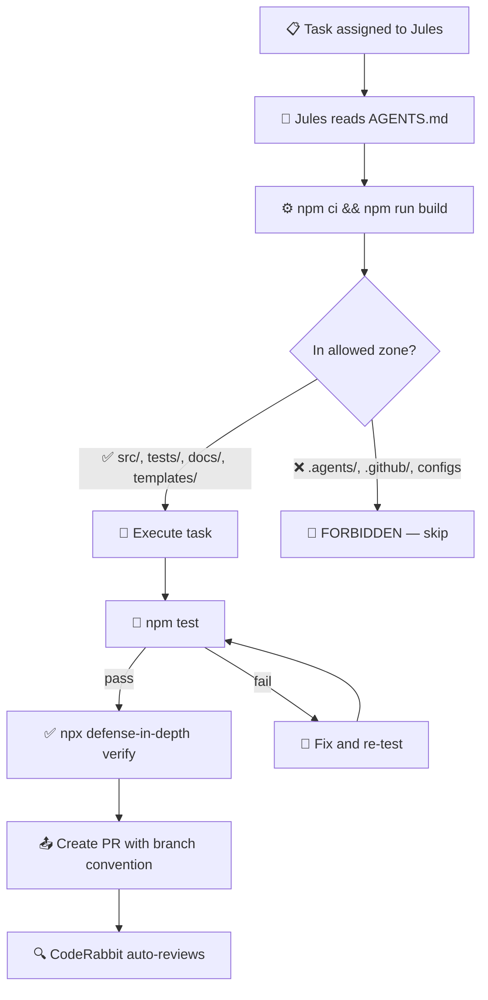

# Contract: Jules (Google) — External Builder Agent

> **Classification: External Agent (Third-Party Tool)**
>
> Jules is an autonomous, asynchronous coding agent operated by Google.
> It runs in an isolated Google Cloud VM, reads `AGENTS.md`, and creates PRs.
>
> Jules is NOT an operational agent — it is a **third-party service** that the
> defense-in-depth project leverages to optimize routine tasks (test writing,
> bug fixes, doc updates). It can be removed without affecting the project's
> core development workflow.
>
> **This contract is specific to the DiD project's internal operations.**
> It is NOT a requirement for DiD package users.

## Decision Flowchart



---

## Allowed Zones ✅

Jules MAY create, modify, or delete files in these directories:

| Directory | Purpose | Notes |
|---|---|---|
| `src/**` | Source code | Except `src/core/types.ts` (type changes need architect) |
| `tests/**` | Test files | Excellent use case for Jules |
| `docs/**` | Documentation | Except governance docs in `docs/vision/` |
| `templates/**` | Shipped templates | Must follow existing conventions |
| `examples/**` | Example configurations | Must be self-contained |

---

## Forbidden Zones 🚫

Jules MUST NOT modify these files under any circumstances:

| Path | Reason |
|---|---|
| `AGENTS.md` | Root governance — human-only |
| `GEMINI.md` | Agent-specific config — human-only |
| `CLAUDE.md` | Agent-specific config — human-only |
| `STRATEGY.md` | Strategic direction — human-only |
| `.agents/**` | Governance ecosystem — human-only |
| `.coderabbit.yaml` | Review config — human-only |
| `.github/**` | CI/CD workflows — human-only |
| `package.json` | Dependencies — architect approval required |
| `tsconfig.json` | Compiler config — architect approval required |
| `defense.config.yml` | User-facing config — architect approval required |
| `LICENSE` | Legal — human-only |
| `SECURITY.md` | Security policy — human-only |
| `CODE_OF_CONDUCT.md` | Community policy — human-only |
| `CONTRIBUTING.md` | Contribution guide — human-only |

---

## Required Commands

Before creating a PR, Jules MUST successfully run:

```bash
# 1. Clean install
npm ci

# 2. Build (TypeScript compilation)
npm run build

# 3. Run full test suite
npm test

# 4. Self-verify (dogfooding)
npx defense-in-depth verify
```

**If any command fails, Jules MUST fix the issue before creating the PR.**

---

## Branch Naming Convention

Jules MUST use these branch patterns:

```
feat/jules-<description>    # New features
fix/jules-<description>     # Bug fixes
docs/jules-<description>    # Documentation updates
test/jules-<description>    # Test additions
refactor/jules-<description> # Refactoring
```

Examples:
- `fix/jules-http-timeout-handling`
- `test/jules-federation-edge-cases`
- `docs/jules-api-reference-update`

---

## Commit Convention

All commits MUST follow conventional commit format:

```
type(scope): description

Executor: Jules
```

Types: `feat`, `fix`, `docs`, `test`, `refactor`, `chore`

---

## Task Suitability Guide

### Excellent for Jules ✅

- Writing or expanding test suites
- Bug fixes with clear reproduction steps
- Documentation updates (non-governance)
- Adding JSDoc/TSDoc comments
- Simple refactoring (rename, extract function)
- Dependency-free feature additions

### NOT suitable for Jules ❌

- Architectural changes (new guard patterns, engine modifications)
- Type system changes (`src/core/types.ts`)
- Governance file modifications
- Multi-phase features requiring human judgment
- Security-sensitive changes
- Breaking API changes

---

## Test Quality Requirements

> [!IMPORTANT]
> LLMs exhibit **Happy Path Complacency** — they write nominal-case tests that
> create false coverage metrics. The following rules mitigate this PROVEN risk.

### Mandatory Input: Adversarial Test Spec

When assigned a testing task, Jules MUST receive an **edge_cases.md** spec
(provided in the prompt or committed to the repo). Jules MUST NOT invent
test scenarios from scratch — it implements the spec.

The spec MUST include:
- Specific edge-case scenarios to cover
- Mock audit: ALL external dependencies to mock
- Assertion rules (behavioral, not snapshot matching)

### Test Writing Rules

Jules tests MUST follow these rules:

| Rule | Rationale |
|---|---|
| **Behavioral assertions only** | No `expect(output).toEqual("literal string")` — assert behavior, not format |
| **Full mock coverage** | Every external dep (fetch, Redis, DB, fs) must be mocked. No partial mocking. |
| **Dependency audit comment** | Each test file must have a `// Dependencies: [list]` header comment |
| **Mutation sensitivity** | Changing ONE line of source logic MUST cause at least ONE test to fail |
| **No snapshot matching** | `toMatchSnapshot()` is forbidden for logic tests |

### Provider Parity Requirement

When testing providers that implement a shared interface (e.g., `TicketProvider`):
- Tests MUST feed a **fully-populated** object with ALL fields set
- Tests MUST assert that 100% of fields survive the round-trip (read → write → read)
- This prevents silent field-drop from TypeScript structural typing

---

## CodeRabbit Interaction

When CodeRabbit reviews a Jules PR:

1. **CodeRabbit comments** → Jules does NOT auto-fix. Human decides.
2. **CodeRabbit Request Changes** → PR is blocked. Human reviews the feedback.
3. **CodeRabbit approves** → N/A (CodeRabbit cannot approve in this project)

> [!IMPORTANT]
> Jules NEVER has auto-merge capability. Every Jules PR requires
> explicit human review and merge. This is the HITL enforcement principle.

---

## Human Review Gate for Jules Test PRs

Before merging ANY test PR from Jules, the reviewer MUST answer:

- [ ] **Mutation test**: "If I delete one line of source logic, which test fails?" — Must be answerable.
- [ ] **Edge-case coverage**: All scenarios from edge_cases.md are implemented.
- [ ] **Mock completeness**: No external dependency is called without a mock.
- [ ] **No ghost mocks**: All `vi.mock()` / `jest.mock()` targets exist in current source.
- [ ] **Assertion depth**: Tests assert behavior/error types, not string literals.
