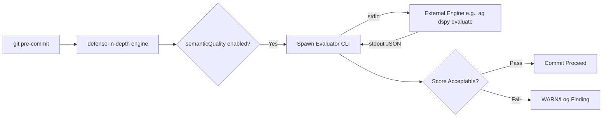

# Semantic Evaluation Guide (v0.5+)

The `defense-in-depth` CLI relies on a strict philosophy of **Zero-Infrastructure, CLI-First**. When we needed to integrate **DSPy Semantic Foundations** to check if an artifact is hollow and semantically valid, incorporating heavyweight LLM/DSPy Node.js packages into the core was prohibited. 

Instead, defense-in-depth utilizes an **Opt-In CLI Semantic Provider Pattern**.

## How It Works

The Semantic Quality Guard (`semanticQuality`) extracts Markdown files from Git staged changes, reads them, and pipelines them into a locally available CLI command via standard streams.



## Configuring the CLI Provider

By default, the `semanticQuality` guard is disabled. To enable it and point it to a CLI process:

```yaml
version: "0.5.0"
guards:
  semanticQuality:
    enabled: true
    provider: "cli-command"
    minScoreThreshold: 0.7
    timeoutMs: 15000
    providerConfig:
      command: "ag"
      args: ["dspy", "evaluate-artifact", "--file", "{{artifactPath}}"]
```

### Protocol

1. **Invocation**: The defense-in-depth engine calls `spawn("ag", ["dspy", ...])`.
2. **Context Passing**: The engine pushes the raw file contents and the evaluation criteria into the `stdin` stream of the child process.
3. **Response Expectation**: The child process must write a valid JSON object matching this schema to its `stdout`:

```json
{
  "score": 0.85,
  "reasoning": "Provides detailed root cause analysis.",
  "evidenceTags": ["[HOLLOW_FREE]", "[STRONG_RCA]"]
}
```

### Zero-Dependency Graceful Degradation

If the CLI fails to execute, or if it times out (`> timeoutMs`), the Semantic Guard defaults to **WARN** and does NOT block the git pipeline. This ensures that users lacking external AI capabilities are never locked out of doing basic Git routines.

### Context Amplification (TKID)
If the ticket identity guard (TKID Tracker) is active, semantic evaluation dynamically attaches the Ticket ID to the criteria pushed to `stdin`. For systems deeply integrated with the `ag` CLI, this allows the external DSPy engine to read `problem_statement.md` and evaluate if the artifact fulfills the goal of that particular slice of work!
