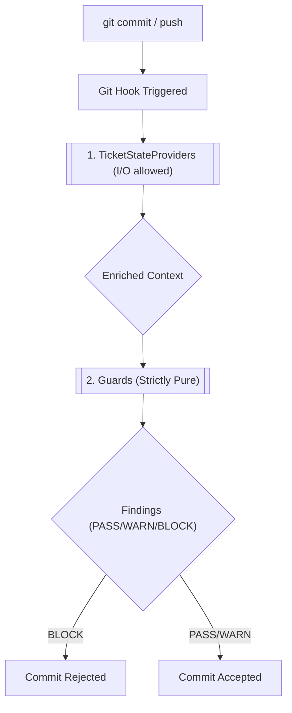

# Ticket State Providers

**Ticket State Providers** enable `defense-in-depth` to read ticket context (such as the current ticket ID, phase, and type) from external sources or files, rather than relying solely on Git branch names. 

Guards in `defense-in-depth` are strictly pure functions—they evaluate data without performing I/O. **Providers** bridge this gap by performing the dirty work of reading files, calling APIs, or checking databases before guards run.

## How it Works

The pipeline executes Providers before evaluating Guards, ensuring the context is enriched prior to purely functional checks.



## The Default `file` Provider

Since `defense-in-depth` adheres to a zero-infrastructure philosophy, the default provider is the `file` provider.

By default, it looks for a `TICKET.md` file located at the root of your project:

```yaml
---
id: TK-20260408-001
phase: EXECUTING
type: feat
---
# Mission
Your ticket description goes here...
```

If `TICKET.md` exists and contains valid YAML frontmatter, the provider extracts the metadata (`id`, `phase`, `type`) and passes it to the `ticketIdentity` guard.

## Configuration

You can configure the provider and its settings in your `defense.config.yml` under the `ticketIdentity` guard.

```yaml
guards:
  ticketIdentity:
    severity: warn
    provider: file
    providerConfig:
      ticketFile: "records/current_ticket.md" # Optional: Custom file path
```

If no config is provided, the engine defaults to the `file` provider with the path `TICKET.md`.

## Building Custom Providers
For enterprise integrations (e.g., Jira, Linear), you can build custom providers. See [Writing Providers](../dev-guide/writing-providers.md) for instructions.
